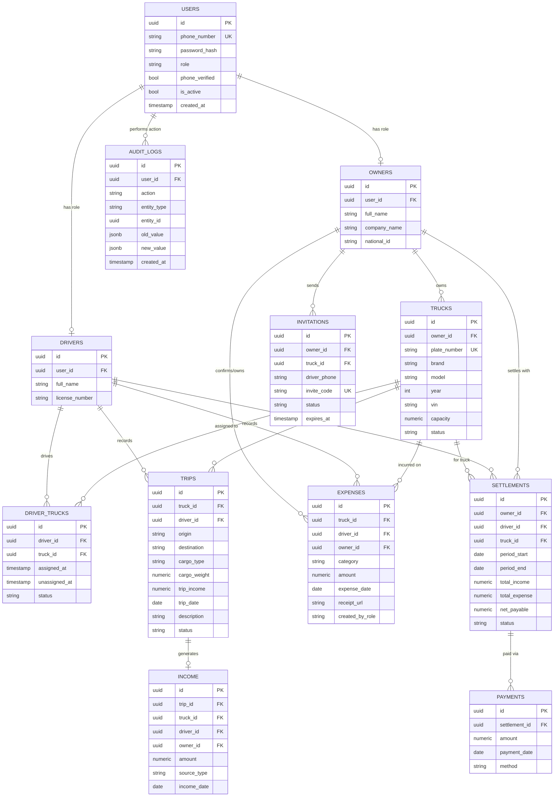

# TruckAccounting — Phase 1: Architecture & Design Document

یک اپلیکیشن Android واحد (`TruckAccounting.apk`) که هم «صاحب کامیون» (Owner) و هم «راننده» (Driver) از همان برنامه، با Login/Register و محیط جداگانه، استفاده می‌کنند. هیچ APK دومی وجود ندارد.

---

## 1. نمای کلی معماری

```
┌─────────────────────────────┐
│      Android App (Kotlin)   │
│  Jetpack Compose · MVVM     │
│  Owner UI  |  Driver UI     │
│  (یک APK — دو محیط داخلی)   │
└───────────────┬─────────────┘
                │ HTTPS (REST, JSON)
                ▼
┌─────────────────────────────┐
│         Backend API         │
│  (Auth · RBAC · Business    │
│   Logic · Validation)       │
└───────────────┬─────────────┘
                │ SQL
                ▼
┌─────────────────────────────┐
│        PostgreSQL           │
└─────────────────────────────┘
```

نکتهٔ کلیدی: Android **هرگز مستقیم** به PostgreSQL وصل نمی‌شود؛ همهٔ عملیات از طریق Backend API انجام می‌شود. این هم امنیت را تضمین می‌کند (کاربر به دیتابیس دسترسی خام ندارد) و هم Business Rule‌ها (مثل «راننده فقط کامیونی که به آن متصل است را ببیند») در یک نقطه (Backend) کنترل می‌شوند، نه در کلاینت.

---

## 2. بررسی Stack پیشنهادی Android

Stack درخواستی شما (Kotlin، Jetpack Compose، MVVM، Clean Architecture، Hilt، Retrofit، OkHttp، Coroutines، Flow، Room، WorkManager، DataStore) **کاملاً مناسب این پروژه است** و نیازی به تغییر اساسی ندارد. دلیل هر انتخاب:

| فناوری | نقش در پروژه | چرا مناسب است |
|---|---|---|
| Kotlin | زبان اصلی | استاندارد رسمی Android، null-safety برای داده‌های مالی حیاتی است |
| Jetpack Compose | UI | دو محیط Owner/Driver با UI مشابه ولی نه یکسان → Composable قابل استفاده مجدد آسان می‌سازد |
| MVVM + Clean Architecture | لایه‌بندی | جدا نگه‌داشتن منطق Owner از Driver در لایهٔ Domain، بدون duplicate کد |
| Hilt | Dependency Injection | مدیریت دو Graph جدا (Owner Feature / Driver Feature) در یک Module گراف واحد |
| Retrofit + OkHttp | ارتباط با Backend | Interceptor برای JWT/Refresh Token، Logging، Retry |
| Coroutines + Flow | Async و Reactive State | همگام‌سازی داده‌های مالی (درآمد/هزینه) به‌صورت Real-time-ish با Flow |
| Room | Local Cache / Offline | نمایش داشبورد حتی بدون اینترنت، پایهٔ Offline Sync آینده |
| WorkManager | کار پس‌زمینه | Sync دوره‌ای، آپلود رسید هزینه‌ها وقتی اینترنت وصل شد |
| DataStore | ذخیرهٔ تنظیمات/Session | جایگزین امن‌تر SharedPreferences برای نگه‌داشتن Role کش‌شده و تنظیمات |

**یک پیشنهاد اضافه (نه تغییر، بلکه مکمل):** برای Navigation بین دو محیط، از **Navigation Compose با Nested Graphs** استفاده شود: یک Graph برای `auth`، یک Graph برای `owner`، یک Graph برای `driver`. این ساختار دقیقاً همان چیزی است که در بخش ۹ (Folder Structure) پیاده شده.

جمع‌بندی: Stack تغییر نمی‌کند؛ فقط نحوهٔ سازمان‌دهی ماژول‌ها (بخش ۹) طوری طراحی شده که یک اپ با دو محیط را تمیز نگه دارد.

---

## 3. طراحی دیتابیس (PostgreSQL)

### 3.1 نمودار روابط (ERD)



### 3.2 توضیح روابط مهم

- **users → owners / drivers**: هر رکورد `users` دقیقاً یکی از `owners` یا `drivers` را دارد (بر اساس ستون `role`). این تفکیک به این دلیل است که فیلدهای Owner (نام شرکت، کد ملی) و Driver (شماره گواهینامه) متفاوتند، ولی احراز هویت (شماره موبایل/رمز/OTP) مشترک است.
- **driver_trucks**: جدول واسط چندبه‌چند بین `drivers` و `trucks` است، نه یک فیلد `driver_id` مستقیم روی `trucks`. دلیل: یک کامیون در طول زمان می‌تواند رانندگان مختلفی داشته باشد (تاریخچه با `assigned_at` / `unassigned_at`)، و به‌صورت نظری یک راننده هم می‌تواند به بیش از یک کامیون متصل باشد. فیلد `status='active'` مشخص می‌کند اتصال فعلی کدام است.
- **invitations**: مستقل از `driver_trucks` است چون دعوت ممکن است هرگز قبول نشود (`status='expired'/'cancelled'`)؛ وقتی راننده دعوت را قبول کرد، یک رکورد جدید در `driver_trucks` ساخته می‌شود.
- **income.trip_id nullable**: بیشتر درآمدها از یک سفر می‌آیند، اما امکان ثبت درآمد مستقل (مثلاً کرایهٔ اضافه) هم باید باشد؛ به همین دلیل `trip_id` اختیاری است.
- **settlements**: به ازای هر (owner, driver, truck, بازهٔ زمانی) یک رکورد تسویه ساخته می‌شود که `total_income`, `total_expense` و `net_payable` را نگه می‌دارد؛ `payments` تاریخچهٔ پرداخت‌های واقعی روی همان تسویه است (چون یک تسویه ممکن است طی چند پرداخت انجام شود).
- **audit_logs**: مستقل از باقی جداول، برای هر عملیات حساس (ایجاد/ویرایش/حذف در trucks, expenses, settlements, invitations) یک رکورد ثبت می‌شود؛ برای تحقیق در دعاوی مالی بین Owner و Driver ضروری است.

---

## 4. Authentication Flow

```
App Open
   │
   ▼
Check Local Session (DataStore: token + role)
   │
   ├── Token Valid & Not Expired ───► Fetch/Confirm Role from Backend ───► Dashboard (Owner/Driver)
   │
   └── No Token / Expired
          │
          ▼
     Role Selection (فقط برای انتخاب UI مسیر Register/Login، نه منبع حقیقت Role)
          │
          ▼
     Login / Register (Phone + Password یا OTP)
          │
          ▼
     Backend صادر می‌کند: Access Token (JWT, کوتاه‌مدت) + Refresh Token
          │
          ▼
     Backend مقدار role واقعی کاربر را برمی‌گرداند
          │
          ▼
     ذخیرهٔ امن Token در Android Keystore-backed storage
          │
          ▼
     Dashboard مطابق role واقعی برگشتی از Backend
```

**قانون حیاتی:** انتخاب کاربر در صفحهٔ «شما چه کسی هستید؟» فقط تعیین می‌کند کدام فرم Login/Register نمایش داده شود. Role نهایی همیشه چیزی است که **Backend** در پاسخ Login/Register برمی‌گرداند و در JWT claim قرار می‌دهد. اگر کاربری با موبایلی که قبلاً به‌عنوان Driver ثبت شده، تلاش کند از مسیر Owner وارد شود، Backend خطای «این شماره با نقش دیگری ثبت شده» برمی‌گرداند.

---

## 5. Owner Flow

```
Role Selection → Owner
   → Login/Register
      → Owner Dashboard
         ├─ کامیون‌های من → افزودن کامیون → (ثبت در Backend)
         ├─ رانندگان → دعوت راننده (تولید invite_code) → (راننده در برنامه دعوت را قبول می‌کند)
         ├─ سفرها و بارها → مشاهدهٔ سفرهای ثبت‌شده توسط رانندگان
         ├─ درآمدها / هزینه‌ها → مشاهده و فیلتر بر اساس کامیون/راننده/بازه
         ├─ تسویه حساب → محاسبهٔ خودکار (درآمد − هزینه) → ثبت پرداخت
         └─ گزارش‌های مالی → خروجی تجمیعی
```

## 6. Driver Flow

```
Role Selection → Driver
   → Login/Register (یا ورود با کد دعوت در اولین بار)
      → Driver Dashboard
         ├─ کامیون من → مشاهدهٔ اطلاعات کامیون متصل (فقط خواندنی)
         ├─ سفرها و بارها → ثبت سفر جدید (مبدا/مقصد/بار/درآمد)
         ├─ کارکرد → گزارش ماهانهٔ کارکرد
         ├─ درآمد → درآمدهای ثبت‌شده از سفرها
         ├─ هزینه‌ها → ثبت هزینهٔ جدید (سوخت/تعمیر/عوارض...) با رسید
         └─ تسویه حساب → مشاهدهٔ وضعیت تسویه با Owner (فقط خواندنی برای Driver)
```

نکتهٔ Business Rule: راننده فقط می‌تواند داده‌های کامیونی که در حال حاضر به آن متصل است (`driver_trucks.status='active'`) را ببیند و ثبت کند؛ این محدودیت در Backend (نه فقط UI) اعمال می‌شود (بخش ۷، IDOR Protection).

---

## 7. Security Architecture

| لایه | اقدام |
|---|---|
| Transport | فقط HTTPS (TLS 1.2+)، Certificate Pinning در OkHttp برای جلوگیری از MITM |
| Authentication | JWT Access Token (کوتاه‌مدت، مثلاً ۱۵ دقیقه) + Refresh Token (طولانی‌مدت، Rotate هنگام استفاده) |
| Storage روی موبایل | Token هرگز در SharedPreferences ساده ذخیره نمی‌شود؛ از **Android Keystore** (EncryptedSharedPreferences / DataStore رمزنگاری‌شده) استفاده می‌شود |
| Authorization | RBAC در سطح Backend: هر Endpoint نقش لازم (`owner` / `driver`) را چک می‌کند |
| IDOR Protection | هر Query در Backend علاوه بر `id` منبع، صاحبیت را هم چک می‌کند (مثلاً `WHERE truck.owner_id = current_user.owner_id`) تا Owner/Driver نتوانند به داده‌های سایرین دسترسی پیدا کنند |
| Input Validation | اعتبارسنجی سمت Backend برای همهٔ فیلدها (شماره پلاک، مبلغ‌های مالی غیرمنفی، فرمت شماره موبایل) — کلاینت هم Validation دارد ولی هرگز جایگزین Validation سمت سرور نیست |
| Rate Limiting | محدودیت روی Login/OTP (جلوگیری از Brute-force) و روی تولید `invite_code` |
| Audit Log | هر تغییر روی داده‌های مالی (Trip, Expense, Settlement, Payment) در جدول `audit_logs` با مقدار قبل/بعد ثبت می‌شود |
| Session | امکان Logout از همهٔ دستگاه‌ها با باطل‌کردن Refresh Tokenها در Backend |

---

## 8. معماری Offline (پایه برای آینده)

```
Android
 ├── Room (Local Cache)  ← نمایش سریع Dashboard حتی آفلاین
 └── Retrofit/OkHttp → Backend API (منبع حقیقت)

جریان آیندهٔ Sync:
Local Change (مثلاً ثبت هزینه آفلاین)
   → ذخیره در Room با وضعیت "pending_sync"
   → WorkManager صف را وقتی اینترنت وصل شد پردازش می‌کند
   → ارسال به Backend
   → به‌روزرسانی PostgreSQL
   → برگشت پاسخ → به‌روزرسانی وضعیت رکورد Room به "synced"
```

در Phase 1 فقط ساختار Room (Entity + DAO) طراحی می‌شود؛ Sync واقعی در فازهای بعدی پیاده‌سازی خواهد شد.

---

## 9. ساختار پوشهٔ پروژهٔ Android (Phase 2 — پیش‌نمایش)

```
TruckAccounting/
├── app/                              (Application module, DI graph, Navigation host)
├── core/
│   ├── network/                      (Retrofit, OkHttp, Interceptors)
│   ├── database/                     (Room database)
│   ├── datastore/                    (DataStore: session, settings)
│   ├── security/                     (Keystore helpers, token storage)
│   ├── designsystem/                 (Compose theme, shared components)
│   └── common/                       (Result wrapper, utils)
├── feature/
│   ├── auth/                         (Role selection, Login/Register — مشترک)
│   ├── owner/
│   │   ├── dashboard/
│   │   ├── trucks/
│   │   ├── drivers/
│   │   ├── trips/
│   │   ├── income/
│   │   ├── expenses/
│   │   ├── settlement/
│   │   └── reports/
│   └── driver/
│       ├── dashboard/
│       ├── truck/
│       ├── trips/
│       ├── income/
│       ├── expenses/
│       └── settlement/
└── navigation/                       (Nested NavGraphs: auth / owner / driver)
```

این ساختار طبق Clean Architecture در هر `feature/*` به سه لایهٔ `data / domain / presentation` تقسیم می‌شود. **این بخش صرفاً پیش‌نمایش است و در Phase 1 پیاده‌سازی نمی‌شود.**

---

## 10. جمع‌بندی خروجی Phase 1

| # | مورد | وضعیت |
|---|---|---|
| 1 | Architecture Document | ✅ همین فایل |
| 2 | Database Schema | ✅ بخش ۳ |
| 3 | Entity Relationships | ✅ بخش ۳ (ERD) |
| 4 | Authentication Flow | ✅ بخش ۴ |
| 5 | Owner Flow | ✅ بخش ۵ |
| 6 | Driver Flow | ✅ بخش ۶ |
| 7 | Security Architecture | ✅ بخش ۷ |
| 8 | Android Architecture | ✅ بخش ۲ و ۸ |
| 9 | Project Folder Structure | ✅ بخش ۹ |
| 10 | HTML Prototype | ✅ `prototype/index.html` |
| 11 | README اجرای Prototype | ✅ `prototype/README.md` |

**Android App واقعی هنوز ساخته نشده است — طبق قانون پروژه.**

این بخش تغییراتی را ثبت می‌کند که در چرخهٔ بازبینی HTML Prototype به تأیید رسیدند و باید در Phase 2 (پیاده‌سازی واقعی Android + Backend) لحاظ شوند:

### 11.1 تغییر نام‌گذاری: «سفر/بار» → «سرویس»
موجودیت `trips` در تمام لایه‌های UI با عنوان **«سرویس»** نمایش داده می‌شود (نه «سفر» یا «بار»). نام جدول/Entity در دیتابیس (`trips`) و ساختار کد می‌تواند به همان شکل بماند یا برای هم‌راستایی با UI به `services` تغییر نام یابد؛ تصمیم نهایی در Phase 2 با تیم توسعه است، اما تمام Label/Stringهای رابط کاربری باید «سرویس» باشند.

### 11.2 فیلدهای جدید روی `trips`
برای پشتیبانی از تسویهٔ per-service:
```
trips.commission        numeric   -- کمیسیون بارنامه (توسط Owner در زمان تسویه وارد می‌شود)
trips.settled           boolean   -- آیا این سرویس تسویه شده یا نه
trips.paid_to           enum      -- 'driver' | 'owner' | null — وجه بارنامه به حساب چه کسی واریز شده
```

### 11.3 فیلدهای جدید روی `drivers` (یا جدول واسط `driver_trucks`)
```
drivers.pay_type    enum     -- 'percent' | 'salary'
drivers.pay_value   numeric  -- درصد (اگر percent) یا مبلغ ثابت ماهانه (اگر salary)
```
منطق محاسبهٔ حقوق راننده:
- اگر `pay_type='percent'`: حقوق هر سرویس = `(trips.income - trips.commission) * pay_value / 100`؛ جمع تمام سرویس‌ها = حقوق کل دورهٔ راننده.
- اگر `pay_type='salary'`: حقوق دورهٔ راننده = مقدار ثابت `pay_value`، مستقل از تعداد سرویس‌ها.
- مبلغی که طی سرویس‌های `settled=true AND paid_to='driver'` مستقیماً نزد راننده مانده، از حقوق محاسبه‌شده کسر می‌شود تا مانده قابل پرداخت توسط Owner به دست آید.

### 11.4 واحد پول
واحد پیش‌فرض نمایش مبالغ در سراسر برنامه **ریال** است؛ کاربر می‌تواند از تنظیمات به **تومان** تغییر دهد. پیشنهاد می‌شود مقادیر پولی در دیتابیس همیشه با یک واحد پایه (مثلاً ریال) ذخیره شوند و تبدیل واحد فقط در لایهٔ نمایش (Presentation) انجام شود؛ این تنظیم باید در DataStore کاربر (نه سراسر اپ) ذخیره شود. همچنین همهٔ اعداد در UI با ارقام لاتین (0-9) و جداکنندهٔ هزارگان نمایش داده می‌شوند، بدون خلاصه‌سازی (نظیر «هزارت»).

### 11.5 عملیات جدید مورد نیاز در Backend API
- ویرایش/حذف کامیون (`PUT/DELETE /trucks/{id}`) — در UI از طریق long-press روی کارت کامیون.
- تنظیم/به‌روزرسانی نحوهٔ محاسبهٔ حقوق راننده (`PUT /drivers/{id}/pay-settings`).
- به‌روزرسانی وضعیت تسویهٔ هر سرویس به‌صورت جداگانه (`PATCH /trips/{id}/settlement` با بدنهٔ `{commission, settled, paid_to}`) — فقط برای نقش Owner مجاز است؛ Driver فقط دسترسی خواندنی به این فیلدها دارد (IDOR/RBAC باید این محدودیت را در Backend اعمال کند).
- مشاهدهٔ جزئیات کامل یک سرویس به‌صورت فقط-خواندنی برای هر دو نقش (`GET /trips/{id}`)، بدون Endpoint ویرایش برای Driver پس از ثبت اولیه.

### 11.6 پروفایل و اشتراک
آیکون پروفایل در Dashboard اکنون مستقیماً به صفحهٔ «پروفایل من» می‌رود (نه یک منوی عمومی تنظیمات). برای Owner، این صفحه شامل بخش «اشتراک» است (روزهای باقی‌مانده، هزینهٔ اشتراک به‌صورت سالانه) که در Phase 1 صرفاً نمایشی/Mock است. در Phase 2، وقتی مدل اشتراک فعال شود، این بخش باید به Entity واقعی `subscriptions` (owner_id, plan, started_at, expires_at, annual_price, status) متصل شود. نوار همبرگر (سه‌خط) که قبلاً کنار عنوان Dashboard بود حذف شده و از معماری ناوبری اپلیکیشن (بخش ۹) کنار گذاشته می‌شود؛ دسترسی به گزارش‌ها/تنظیمات/خروج از طریق تب «بیشتر» در Bottom Navigation باقی می‌ماند.

### 11.7 فرم افزودن کامیون — سادهٔ‌سازی و فرمت پلاک ایرانی
فرم «افزودن/ویرایش کامیون» فقط شامل سه گروه فیلد است: **شماره پلاک، برند، مدل**. فیلدهای سال ساخت و ظرفیت و شماره شاسی از فرم حذف شدند؛ فیلد «مدل» اکنون برای وارد کردن **عدد سال ساخت** استفاده می‌شود (نه نام تجاری مدل مثل FH).

شماره پلاک به‌صورت فرمت استاندارد پلاک ایران با چهار بخش ورودی جداگانه گرفته می‌شود: دو رقم — حرف (از بین حروف مجاز پلاک) — سه رقم — کد دو رقمی استان، به‌همراه برچسب ثابت «ایران» و نماد پرچم/کشور در ابتدای ویجت. مقدار نهایی پلاک به‌صورت رشتهٔ ترکیبی `NN حرف NNN ایران PP` ذخیره می‌شود. در Backend/Database، پیشنهاد می‌شود این فرمت یا به همین شکل رشته‌ای اعتبارسنجی و ذخیره شود، یا به چهار ستون مجزا (`plate_num1`, `plate_letter`, `plate_num2`, `plate_province`) در جدول `trucks` تفکیک گردد تا اعتبارسنجی دقیق‌تری (مثلاً کنترل کد استان معتبر) در سطح Backend ممکن باشد.

### 11.8 محاسبهٔ حقوق راننده — انحصار متقابل (Mutual Exclusivity)
مدل داده برای حقوق راننده باید همیشه **دقیقاً یکی** از دو حالت را نگه دارد، نه هر دو: یک فیلد `pay_type` (`percent` یا `salary`) به‌همراه یک فیلد مقدار واحد `pay_value` که بسته به نوع، یا درصد است یا مبلغ ثابت ماهانه. هیچ‌گاه نباید دو ستون جداگانه (یکی برای درصد و یکی برای حقوق ثابت) هم‌زمان مقدار داشته باشند؛ تغییر نوع محاسبه باید مقدار قبلی را overwrite کند، نه اینکه کنارش نگه دارد. این قانون در Prototype در ساختار `{payType, payValue}` (تک‌فیلدی) پیاده‌سازی شده و باید عیناً در schema واقعی (`drivers.pay_type`, `drivers.pay_value`) رعایت شود.

### 11.9 داده‌های نمونه (Seed Data)
Prototype به‌صورت پیش‌فرض با چند رکورد نمونه (کامیون، راننده، سرویس، هزینه) پر شده تا رفتار صفحات از ابتدا قابل مشاهده باشد؛ این داده‌ها مستقیماً در آرایه‌های `store` در ابتدای اسکریپت قرار دارند و برای شروع یک تست خالی می‌توان به‌سادگی آن‌ها را در همان‌جا خالی کرد. در Phase 2، دیتابیس واقعی (Migration) نباید داده‌ی Seed نمایشی داشته باشد؛ فقط Schema خالی ساخته شود — داده‌های نمونهٔ فعلی صرفاً برای دموی Prototype در مرورگر است.

### 11.10 دورهٔ رایگان یک‌ماهه و اشتراک سالانه
هر دو نقش (Owner و Driver) پس از اولین ورود، **یک ماه رایگان** استفاده می‌کنند. پس از پایان این دوره، در ورود بعدی، اپلیکیشن به‌جای Dashboard صفحهٔ Paywall را نمایش می‌دهد که خرید اشتراک سالانه را درخواست می‌کند؛ تا زمان خرید، کاربر نمی‌تواند وارد Dashboard شود. در Backend، این یعنی:
```
subscriptions
  id, user_id, role ('owner'|'driver'), trial_started_at, trial_ends_at,
  status ('trial'|'active'|'expired'), plan ('annual'), price, subscribed_at, expires_at
```
Endpoint ورود (`POST /auth/login`) باید وضعیت `subscriptions.status` کاربر را برگرداند تا کلاینت تصمیم بگیرد Dashboard یا صفحهٔ Paywall را نشان دهد؛ این بررسی هرگز نباید فقط سمت کلاینت باشد، چون کاربر می‌تواند آن را دور بزند — Backend هم باید API‌های حساس (مثل ثبت سرویس، ثبت هزینه) را برای کاربر با اشتراک منقضی مسدود کند. در Prototype، برای امکان تست این رفتار بدون گذشت یک ماه واقعی، یک دکمهٔ «شبیه‌سازی پایان دورهٔ رایگان» در تنظیمات هر دو نقش اضافه شده که صرفاً برای دموی محلی است و نباید در نسخهٔ نهایی وجود داشته باشد.

### 11.11 جریان «تایید» برای تسویهٔ هر سرویس
تغییر وضعیت تسویهٔ هر سرویس (تسویه‌شده/تسویه‌نشده و واریزی به راننده/صاحب کامیون) دیگر بلافاصله با هر کلیک ثبت نمی‌شود؛ Owner ابتدا گزینه‌ها را انتخاب می‌کند و سپس باید دکمهٔ **«تایید»** را بزند تا مقادیر واقعاً ذخیره شوند. پس از تایید، کارت آن سرویس به‌صورت قفل‌شده (فقط‌خواندنی، با پس‌زمینهٔ سبز کم‌رنگ در صورت تسویه‌شدن) نمایش داده می‌شود و یک دکمهٔ **«ویرایش»** برای بازکردن دوبارهٔ فرم و تغییر انتخاب‌ها ظاهر می‌شود. در Backend، این یعنی تغییرات تسویه باید به‌صورت یک عملیات atomic (`PATCH /trips/{id}/settlement` با بدنهٔ کامل `{settled, paid_to}`) ارسال شود، نه به‌صورت دو Request جدا برای هر فیلد؛ همچنین می‌توان یک رکورد Audit Log جداگانه برای هر بار «تایید» تسویه ثبت کرد تا تاریخچهٔ تغییرات وضعیت تسویهٔ هر سرویس قابل پیگیری باشد.

---

## Addendum — Phase 3.1: تغییر پایگاه‌داده از PostgreSQL به MySQL/MariaDB

بخش ۳ این سند («طراحی دیتابیس») و متن بالا صراحتاً PostgreSQL را به‌عنوان دیتابیس تولید نام می‌برند. این تصمیم در Phase 3.1 تغییر کرد: دیتابیس تولید اکنون **MySQL/MariaDB** است، نه PostgreSQL.

**دلیل:** هاست هدف این پروژه یک هاست اشتراکی (پنل نوع DirectAdmin) است که فقط MySQL/MariaDB می‌دهد و PostgreSQL روی آن قابل نصب نیست.

**آنچه این تصمیم تغییر می‌دهد:** فقط لایهٔ ارتباط با دیتابیس (`backend/src/db/`) و طول/نوع دقیق ستون‌های شناسه/کلید در Migration (به‌خاطر نبود `RETURNING` و نیاز MySQL به طول مشخص برای ستون‌های Unique/Foreign Key). **آنچه تغییر نکرد:** API Endpointها، فرمت Request/Response، منطق تجاری، جریان Authentication، اپ Android، و پروتوتایپ HTML — همهٔ این‌ها پشت همان Interface یکسان (`DbClient`) قرار دارند و از این تغییر بی‌خبرند.

جزئیات کامل (چرا `RETURNING` شبیه‌سازی شد، چطور Race-condition حفظ شد، چه چیزی واقعاً روی MySQL/MariaDB واقعی تست شد) در `backend/README.md` و کامنت‌های `backend/src/db/MySqlClient.ts` مستند است — این بخش‌ها مرجع به‌روز هستند، نه بخش ۳ بالا.
